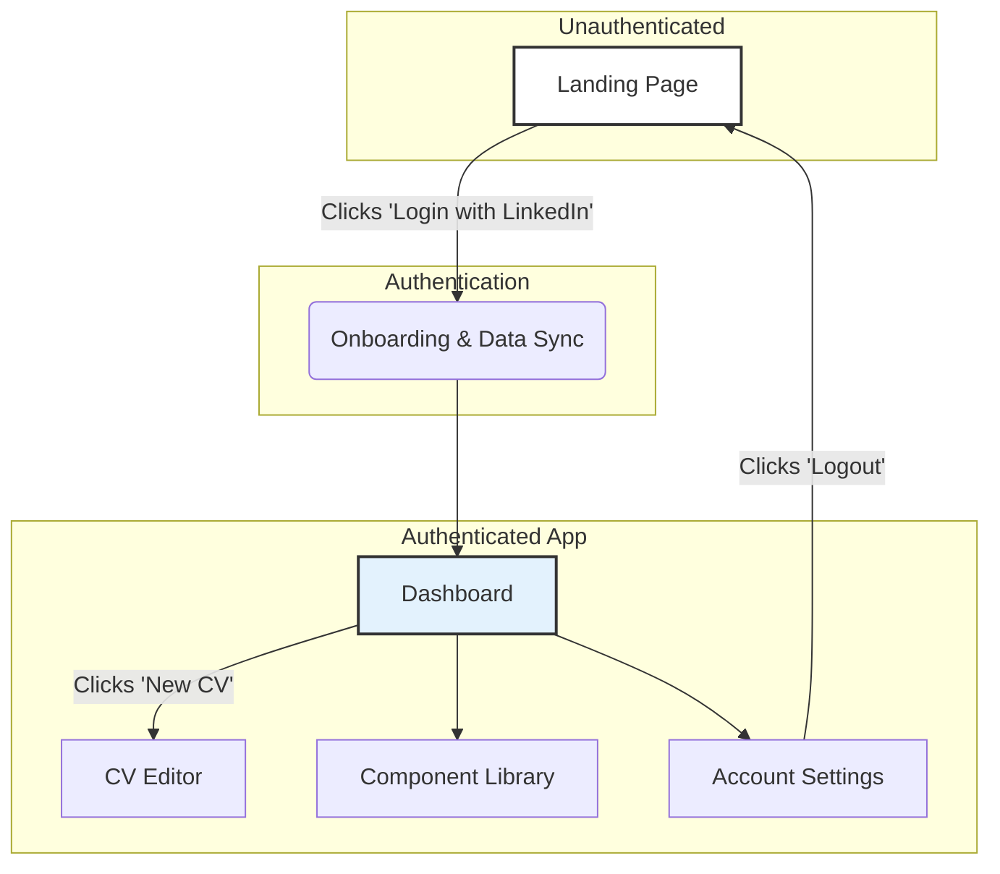
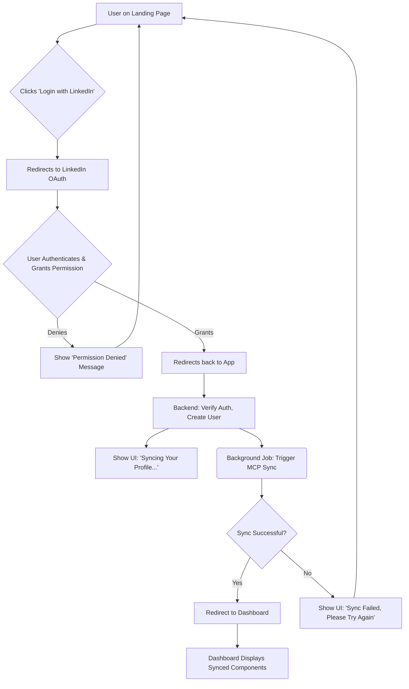
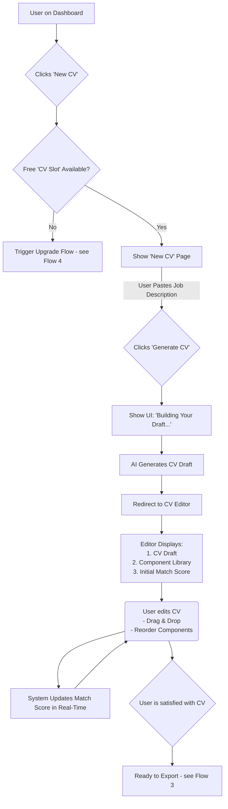
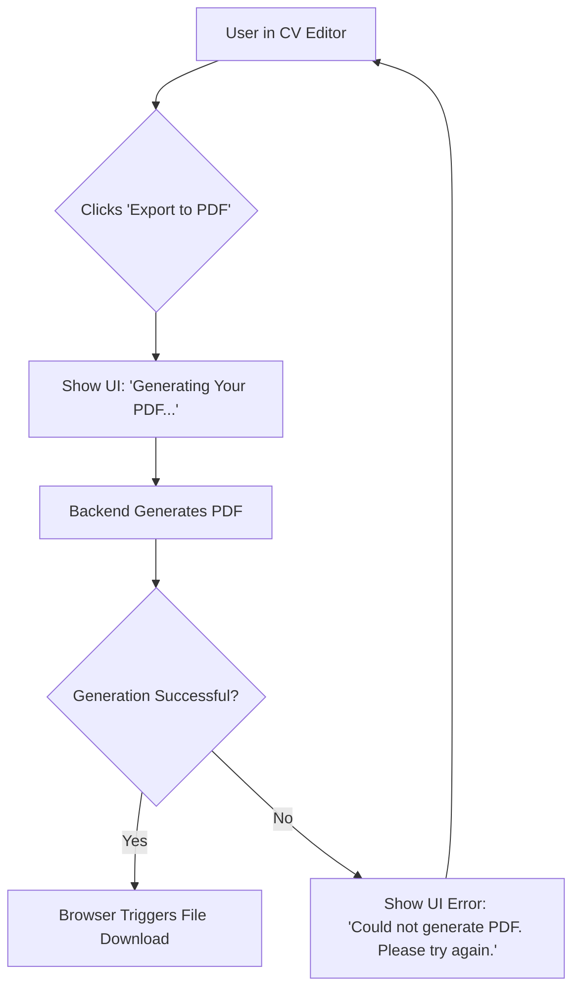
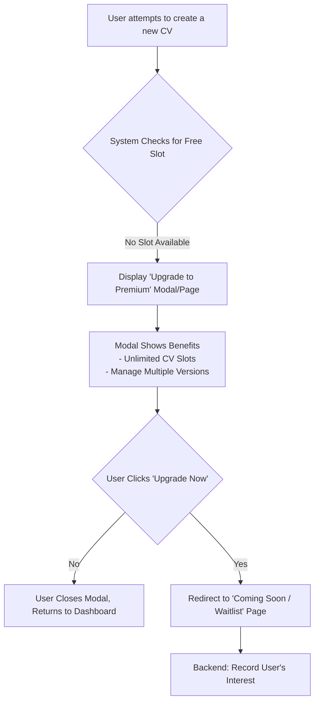

## 🎨 UI/UX Specification
# CV Match UI/UX Specification

## Introduction

This document defines the user experience goals, information architecture, user flows, and visual design specifications for the CV Match user interface. It serves as the foundation for visual design and frontend development, ensuring a cohesive and user-centered experience.

### Overall UX Goals & Principles

#### Target User Personas

  * **The Tech Nomad:** A software developer or tech professional who values efficiency and automation. Their history is on platforms like LinkedIn and GitHub.
  * **The Creative Nomad:** A freelance designer or writer whose portfolio is critical. They need a visually compelling output from sources like Behance.

#### Usability Goals

  * **Efficiency of Use:** Drastically reduce the time it takes for a user to go from sign-up to a job-ready, tailored CV.
  * **Ease of Learning:** Ensure the "One-Click" workflow is immediately understandable, and the "Lego-like" editor is intuitive with minimal guidance.
  * **User Confidence:** Provide clear, real-time feedback (like the "Match Score") to help users feel confident in the quality of their CV.

#### Design Principles

1.  **Efficiency by Default:** The fastest path to a great result should be the default path.
2.  **Clarity Over Cleverness:** Prioritize clear communication and intuitive controls.
3.  **Intelligence Made Visible:** The UI should surface the benefits of the underlying AI, making the user feel empowered, not replaced.
4.  **Progressive Disclosure:** Start simple. Reveal more advanced tools and options as the user needs them.

-----

## Information Architecture (IA)

### Site Map / Screen Inventory

This diagram shows the primary screens of the application and how a user will move between them.

### Navigation Structure

  * **Primary Navigation:** After login, a persistent navigation bar will be visible at the top of all pages. It will provide direct access to the main sections: **Dashboard**, **Component Library**, and a primary call-to-action for **"New CV"**. User-specific actions like **Account Settings** and **Logout** will be accessible through a user profile dropdown menu.
  * **Secondary Navigation:** For the MVP, no complex secondary navigation (sub-menus) is required, as each main section has a flat structure.
  * **Breadcrumb Strategy:** Breadcrumbs will be displayed below the primary navigation to show the user's current location (e.g., `Home > Component Library`). This provides clear orientation and will support future scalability as we add more features.

-----

## User Flows

### Flow 1: First-Time User Onboarding & Initial Data Sync

  * **User Goal:** To quickly sign up for the service using my LinkedIn account and see my professional data automatically imported without manual effort.
  * **Entry Points:** Clicking the "Login with LinkedIn" button on the landing page.
  * **Success Criteria:** The user is logged in and can see a list of their professional experiences and skills populated on their dashboard.

#### Flow Diagram

-----

### Flow 2: Creating and Refining a CV

  * **User Goal:** To generate a CV tailored to a specific job description, and then refine it using the interactive editor to achieve a high 'Match Score'.
  * **Entry Points:** Clicking the "New CV" button on the Dashboard or primary navigation.
  * **Success Criteria:** The user has a refined CV with a high match score that they are confident and ready to export.

#### Flow Diagram

-----

### Flow 3: Exporting the Final CV

  * **User Goal:** To download my finalized CV as a professional-looking PDF.
  * **Entry Points:** Clicking the "Export to PDF" button in the CV Editor.
  * **Success Criteria:** The user has a watermark-free, well-formatted PDF of their CV saved to their local device.

#### Flow Diagram

-----

### Flow 4: Upgrading to Premium

  * **User Goal:** To understand the value of upgrading and express my interest in a premium plan.
  * **Entry Points:** Attempting to create a second CV while on the free plan.
  * **Success Criteria:** The user is clearly informed of the premium plan's benefits and, for the MVP, has their interest recorded.

#### Flow Diagram

-----

## Wireframes & Mockups

### Primary Design Files

The detailed, high-fidelity mockups will be generated using an AI-powered UI tool (like Vercel v0 or Lovable.ai). The low-fidelity wireframes described below will serve as the primary input for generating those designs. There will be no separate Figma or Sketch files for the MVP.

### Key Screen Layouts

#### CV Editor Screen

  * **Purpose:** To provide a powerful, two-panel workspace for users to generate, edit, and refine their CV against a specific job description.
  * **Key Elements:** Header, Main Workspace (Left Panel: CV Preview; Right Panel: Component Library & AI Tools).
  * **Interaction Notes:** Core interaction is drag-and-drop from right to left, triggering real-time Match Score updates.

#### Dashboard Screen

  * **Purpose:** To serve as the user's main hub after logging in, providing an overview and a clear starting point for creating a new CV.
  * **Key Elements:** Header, Welcome Section, Primary CTA Section (for JD), Existing CV Section, Data Sources Section.
  * **Interaction Notes:** Main interaction is pasting a JD and clicking "Generate CV." Button state changes if the free slot is used.

#### Component Library Screen

  * **Purpose:** To provide users with a comprehensive view and management capabilities for all their professional data.
  * **Key Elements:** Header, Title, Primary Actions (Create New, Re-sync), Filtering/Searching, Component List.
  * **Interaction Notes:** Core interactions are editing and deleting components, with real-time search and filtering.

-----

## Component Library / Design System

### Design System Approach

We will leverage **shadcn/ui**, a modern, accessible, and customizable set of components built on Tailwind CSS and Radix UI, to accelerate development.

### Core Components

1.  **Button:** For all clickable actions (Primary, Secondary, Destructive variants).
2.  **Card:** To display self-contained info like CVs and components.
3.  **Text Area:** For large text inputs, especially the Job Description.
4.  **Modal:** For contextual forms and alerts (e.g., Upgrade prompt).
5.  **Dropdown Menu:** For the user profile menu (Settings, Logout).

-----

## Branding & Style Guide

### Visual Identity

The aesthetic will be **clean, modern, and trustworthy**, reflecting our focus on professional data and AI-driven efficiency.

### Color Palette

  * **Primary:** Indigo (`#4f46e5`)
  * **Secondary:** Slate (`#64748b`)
  * **Functional:** Standard Green, Amber, and Red for success, warning, and error states.
  * **Neutral:** A scale of grays for text and backgrounds.

### Typography

  * **Primary Font:** Inter
  * **Monospace Font:** JetBrains Mono

### Iconography

  * **Icon Library:** Lucide Icons

### Spacing & Layout

  * **Grid System:** 8-point grid system.
  * **Spacing Scale:** All spacing will use multiples of `4px`.

-----

## Accessibility, Responsiveness, and Animation

  * **Accessibility:** We will adhere to **WCAG 2.1 Level AA** standards, focusing on color contrast, keyboard navigation, and screen reader support.
  * **Responsiveness:** A standard breakpoint system will be used. The two-panel editor will collapse to a single, tabbed view on mobile, and drag-and-drop will be replaced with tap-to-add interactions.
  * **Animation:** Motion will be **purposeful, not decorative**, focusing on subtle transitions for feedback on interactive states and modals.

-----

## Performance and Next Steps

  * **Performance:** Goals include achieving "Good" Core Web Vitals and ensuring all interactions feel instant (\<100ms response).
  * **Next Steps:** This document should be reviewed, used to generate mockups with an AI UI tool, and then handed off to the Architect for the `front-end-architecture` phase.

\</details\>
